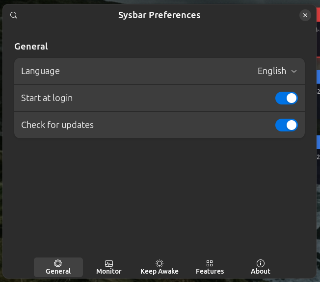
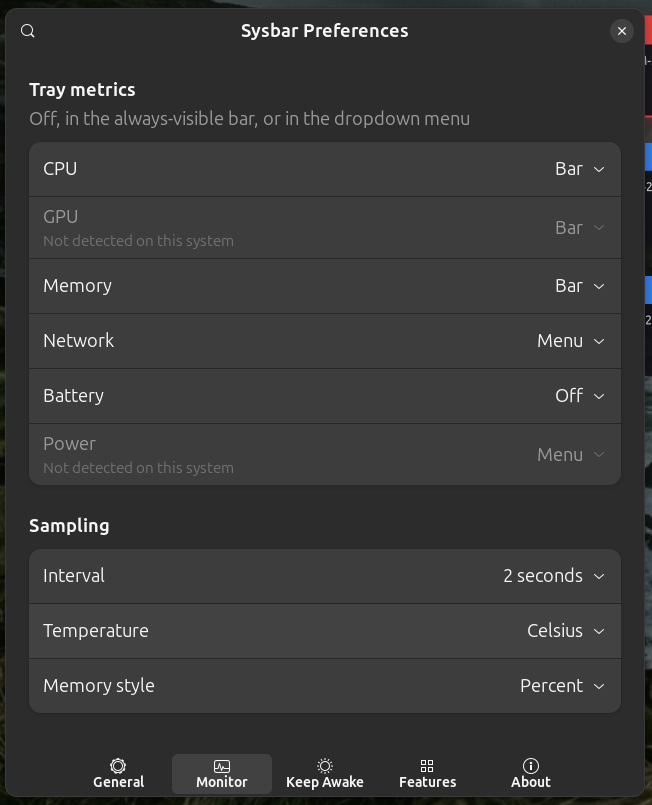
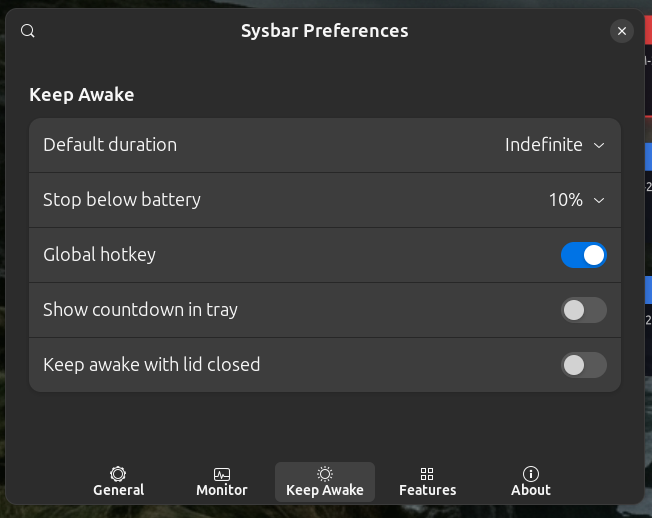
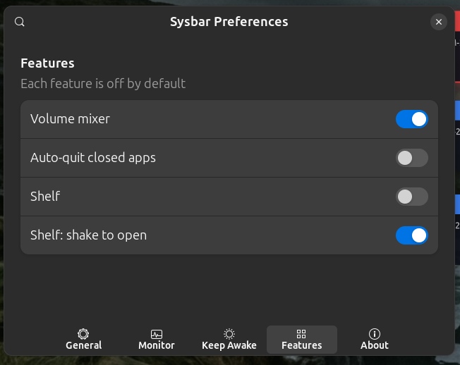
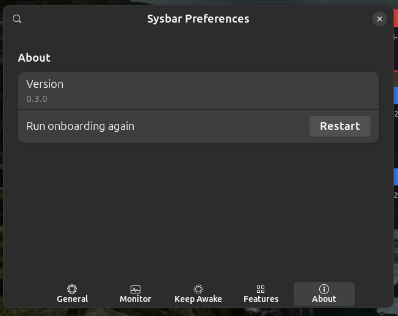
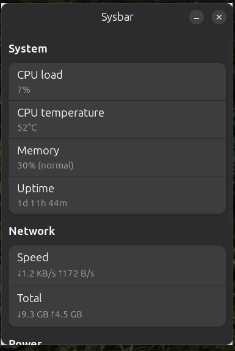
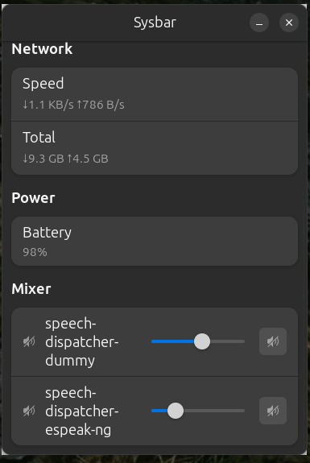

[English](MANUAL.md) | **Italiano**

# Manuale utente di Sysbar

Questo manuale copre Sysbar 1.2.0. Spiega come si usa ogni funzionalità, un
passo alla volta. Per una panoramica più breve di cosa sia Sysbar e di come si
installa, leggi il [README](./README.it.md).

Due cose da sapere prima di tutto il resto. Sysbar non ha una finestra
principale: vive nel tray, a destra nella barra superiore di GNOME, e tutto
parte da quell'icona. E ogni funzionalità è disattivata al momento
dell'installazione, quindi una Sysbar appena installata mostra poco più
dell'icona finché non attivi qualcosa.

## Indice

- [Primo avvio](#primo-avvio)
  - [La schermata di benvenuto](#la-schermata-di-benvenuto)
  - [Cosa sblocca ciascuna capability](#cosa-sblocca-ciascuna-capability)
  - [Rivedere la schermata di benvenuto](#rivedere-la-schermata-di-benvenuto)
- [L'icona nel tray](#licona-nel-tray)
  - [Leggere l'etichetta](#leggere-letichetta)
  - [Il menu a tendina](#il-menu-a-tendina)
- [La finestra delle preferenze](#la-finestra-delle-preferenze)
  - [Generale](#generale)
  - [Monitoraggio](#monitoraggio)
  - [Avvisi](#avvisi)
  - [Tieni sveglio](#tieni-sveglio-scheda)
  - [Funzioni](#funzioni)
  - [Informazioni](#informazioni)
- [Il pannello delle metriche](#il-pannello-delle-metriche)
- [Tieni sveglio](#tieni-sveglio)
- [Mixer del volume e dispositivi audio](#mixer-del-volume-e-dispositivi-audio)
- [Avvisi a soglia](#avvisi-a-soglia)
- [Cronologia degli appunti](#cronologia-degli-appunti)
- [Lo shelf](#lo-shelf)
- [Auto-quit](#auto-quit)
- [Il disinstallatore di applicazioni](#il-disinstallatore-di-applicazioni)
- [Scene](#scene)
  - [Usare una scena](#usare-una-scena)
  - [Creare una scena](#creare-una-scena)
  - [Modificare ed eliminare](#modificare-ed-eliminare)
  - [Trigger automatici](#trigger-automatici)
  - [Quando una scena si applica solo in parte](#quando-una-scena-si-applica-solo-in-parte)
- [La palette dei comandi](#la-palette-dei-comandi)
- [Scorciatoie globali](#scorciatoie-globali)
- [Riga di comando e D-Bus](#riga-di-comando-e-d-bus)
- [Risoluzione dei problemi](#risoluzione-dei-problemi)
- [Dove finiscono i tuoi dati](#dove-finiscono-i-tuoi-dati)
- [Rimuovere Sysbar](#rimuovere-sysbar)

## Primo avvio

Avvia Sysbar dal menu applicazioni, oppure esegui `sysbar` in un terminale. Se
il `.deb` ha installato l'avvio automatico, parte da sola a ogni accesso.

### La schermata di benvenuto

La prima volta che parte, Sysbar apre una finestra intitolata "Benvenuto in
Sysbar" invece di andare dritta al tray. Ha un solo scopo: dirti quali
funzionalità il tuo sistema può davvero reggere, prima che tu le vada a cercare
nelle impostazioni.

Sotto "Rilevato su questo sistema" c'è una riga per capability, ciascuna con una
spunta o un'icona sbarrata. Qui non c'è nessuna decisione da prendere. Leggi
l'elenco, poi premi **Inizia**. La finestra si chiude e compare l'icona nel
tray.

### Cosa sblocca ciascuna capability

| Riga | Cosa abilita | Se manca |
|---|---|---|
| X11 session (auto-quit, shelf shake) | Tracciamento finestre e scuoti-per-aprire su X11 | Sei su Wayland: l'auto-quit richiede la shell extension e lo scuoti-per-aprire non è disponibile |
| Wayland auto-quit (Sysbar shell extension) | Tracciamento finestre su Wayland | Attiva l'extension inclusa, vedi [Risoluzione dei problemi](#risoluzione-dei-problemi) |
| Global keep-awake hotkey | Tutte le scorciatoie globali | La sessione non espone il portale GlobalShortcuts: usa il tray o la riga di comando |
| Tray icon support | L'icona nel tray stessa | Installa `gir1.2-ayatanaappindicator3-0.1`, oppure una shell extension che mostri le icone di tray |
| Temperature sensors | Temperature di CPU e sistema, avvisi di temperatura | L'hardware non espone sensori leggibili da `psutil` |
| Audio mixer and microphone toggle | Mixer per app, selettore dispositivi, silenziamento microfono | PipeWire o PulseAudio non sono in esecuzione |
| Do-not-disturb and dark-mode toggles | Quei due interruttori rapidi, e ogni scena che li usa | Non sei su un desktop GNOME |
| Keep awake | Inibizione di sospensione e idle | `logind` non è raggiungibile |
| Battery metrics | Letture e avvisi di batteria | Manca UPower, oppure è una macchina fissa senza batteria |
| System uninstaller | Rimozione del pacchetto di sistema di un'app | polkit non è disponibile; la rimozione dei residui funziona comunque |

Una capability mancante non rompe mai il resto di Sysbar. La funzionalità che
dipende da quella capability viene disattivata e lo dichiara, il resto continua
a funzionare.

### Rivedere la schermata di benvenuto

Apri il menu del tray, scegli **Impostazioni**, vai alla scheda
**Informazioni** e premi **Riavvia** accanto a "Riesegui l'onboarding". La
schermata di benvenuto ricompare al riavvio successivo. È il modo più rapido per
ricontrollare le capability dopo aver installato un pacchetto mancante o attivato
la shell extension.

## L'icona nel tray

### Leggere l'etichetta

Accanto all'icona, Sysbar stampa le metriche che hai collocato nella barra (vedi
[Monitoraggio](#monitoraggio)). Con una sessione di Tieni sveglio in corso, in
testa compare un marcatore `▶`, seguito dal tempo residuo se la sessione ha una
durata e il conto alla rovescia è attivo.

Se non collochi nessuna metrica nella barra e disattivi le batterie delle
periferiche, Sysbar smette del tutto di campionare per il tray e mostra solo
l'icona.

### Il menu a tendina

Clicca sull'icona. Il menu ha sempre la stessa forma, in questo ordine:

1. **Letture delle metriche**: una riga di sola lettura per ogni metrica
   collocata nel menu.
2. **Batterie delle periferiche**: fino a sei righe per mouse, tastiere, cuffie,
   controller e simili collegati, quando l'opzione è attiva.
3. **Tieni sveglio**: una voce con spunta che avvia e termina la sessione.
4. **Interruttori rapidi**: silenzia o riattiva il microfono, attiva o disattiva
   Non disturbare, passa dal tema chiaro a quello scuro. Ognuno è presente solo
   se la sessione lo supporta. Mentre un'altra applicazione sta registrando, la
   riga del microfono viene sostituita da una voce disabilitata "Microfono in
   uso".
5. **Scene**: un sottomenu con le tue scene più una voce "Nessuna" che azzera
   quella attiva. Contiene fino a otto scene; oltre quel numero usa la finestra
   Scene, la palette o la riga di comando.
6. **Apri pannello**, **Apri shelf**, **Appunti**, **Disinstalla app…**,
   **Impostazioni**: le righe dello shelf e degli appunti compaiono solo se
   quelle funzionalità sono attive.
7. **Esci**.

Le righe che al momento non si applicano vengono nascoste, non rimosse. È
deliberato: su Ubuntu gli host del menu identificano le voci per posizione, e un
menu che cambia lunghezza fra un aggiornamento e l'altro lascerebbe la spunta
sulle voci sbagliate.

## La finestra delle preferenze

Si apre dal menu del tray con **Impostazioni**. Ha sei schede sul lato. Le
modifiche hanno effetto mentre le fai: non c'è un pulsante Salva.

### Generale

- **Lingua**: System, English o Italiano. Cambiarla mostra un messaggio che
  chiede di riavviare Sysbar; le finestre già aperte restano nella lingua
  precedente.
- **Avvia all'accesso**: scrive o rimuove la voce di avvio automatico in
  `~/.config/autostart/`.
- **Controlla aggiornamenti**: chiede a GitHub Releases se esiste una versione
  più recente. Non scarica e non installa mai nulla.
- **Scorciatoie globali**: un interruttore per scorciatoia. Vedi
  [Scorciatoie globali](#scorciatoie-globali) per assegnare i tasti veri e
  propri.
- **Automazione**: un solo interruttore, "Trigger automatici delle scene", che
  permette alle regole delle scene di cambiare la scena attiva da sole.
  Disattivato di default.



### Monitoraggio

- **Metriche nel tray**: CPU, GPU, memoria, rete, batteria e alimentazione.
  Ognuna ha tre posizioni: `Spenta`, `Barra` (nell'etichetta sempre visibile) o
  `Menu` (nel menu a tendina). L'hardware assente dalla macchina è in grigio e
  riporta "Non rilevato su questo sistema".
- **Batteria dispositivi**: elenca nel menu le periferiche collegate.
- **Campionamento**: intervallo (1, 2 o 5 secondi), unità di temperatura
  (Celsius o Fahrenheit) e come si disegna la memoria nella barra (punto,
  percentuale o entrambi).
- **Grafici cronologia**: un interruttore per metrica. Quando è attivo, il
  pannello disegna uno sparkline degli ultimi 120 campioni accanto a quella
  metrica.



### Avvisi

Descritti per esteso in [Avvisi a soglia](#avvisi-a-soglia).

### Tieni sveglio (scheda)

Descritta per esteso in [Tieni sveglio](#tieni-sveglio).



### Funzioni

Gli interruttori principali delle funzionalità opzionali: mixer del volume,
auto-quit, shelf, scuoti per aprire lo shelf, cronologia degli appunti. Tutte
disattivate di default.



### Informazioni

La versione installata, il pulsante che rimanda alla schermata di benvenuto e il
credito del progetto.



## Il pannello delle metriche

Si apre da **Apri pannello** nel menu del tray, dalla palette, oppure con
`sysbar open-panel`. È una finestra scorrevole con un gruppo per argomento:

- **Sistema**: carico CPU, temperatura CPU, GPU, memoria, uptime.
- **Rete**: velocità istantanea e totali cumulati.
- **Alimentazione**: batteria e assorbimento.
- **Controllo ventole (beta)**: velocità delle ventole. Non ha ancora una riga
  nelle impostazioni: si attiva con
  `gsettings set io.github.AndreaBonn.Sysbar monitor-show-fan-control-beta true`
  e riaprendo il pannello.
- **Processi principali**: i cinque processi più pesanti, ognuno con un pulsante
  che lo termina. Sysbar chiede prima conferma, invia `SIGTERM` e passa a
  `SIGKILL` se dopo cinque secondi il processo è ancora vivo.
- **Rete per processo**: i cinque processi che consumano più banda. Legge
  `/proc` e chiama `ss`, quindi richiede `ss` installato e non vede tutti i tipi
  di traffico.
- **Dispositivi audio** e il **mixer del volume**: vedi la sezione successiva.

Le metriche con il grafico cronologia attivo mostrano uno sparkline sulla destra
della riga. Il pannello campiona solo mentre è aperto.



## Tieni sveglio

Tieni sveglio impedisce alla macchina di sospendersi, andare in idle o
sospendersi alla chiusura del coperchio. Serve mentre gira una compilazione
lunga, un download o una videochiamata.

Per avviare una sessione, clicca **Tieni sveglio** nel menu del tray. Accanto
alla voce compare una spunta e accanto all'etichetta nel tray un marcatore `▶`.
Cliccala di nuovo per terminare la sessione.

Il comportamento si configura nella scheda **Tieni sveglio** delle preferenze:

- **Durata predefinita**: Indefinita, 15 minuti, 30 minuti, 1 ora o 2 ore. Una
  sessione a tempo termina da sola quando il tempo scade.
- **Ferma sotto batteria**: Mai, 5%, 10%, 15% o 20%. Un watchdog controlla la
  carica a intervalli regolari e chiude la sessione quando scende sotto la
  soglia, così Tieni sveglio non può scaricare la batteria mentre sei via.
- **Mostra conto alla rovescia nel tray**: stampa il tempo residuo accanto al
  marcatore `▶`.
- **Tieni sveglio a coperchio chiuso**: inibisce anche l'interruttore del
  coperchio. Disattivalo se vuoi che chiudere il coperchio sospenda comunque, anche
  durante una sessione.

Si può commutare anche con una scorciatoia globale, dalla palette, o con
`sysbar toggle-keep-awake`.

## Mixer del volume e dispositivi audio

Attiva **Mixer del volume** nella scheda Funzioni, poi apri il pannello. In
fondo compaiono due gruppi.

**Dispositivi audio** ha una riga Uscita e una riga Ingresso, ciascuna con un
elenco dei dispositivi che il sistema conosce. Sceglierne uno lo rende
predefinito per tutto il desktop, esattamente come sceglierlo nelle impostazioni
audio di GNOME.

Il **mixer** ha un cursore per ogni applicazione che sta riproducendo audio, con
un pulsante di silenziamento. Il volume arriva al 200%, così puoi spingere
un'applicazione troppo silenziosa sopra il livello di sistema. L'elenco segue le
applicazioni mentre aprono e chiudono stream audio; un'applicazione che non
riproduce nulla non compare.

Entrambi richiedono PipeWire o PulseAudio. Senza, il gruppo dichiara che il
mixer non è disponibile invece di mostrare un elenco vuoto.



## Avvisi a soglia

Sysbar può inviare una notifica desktop quando una metrica supera un limite.
Apri le preferenze, vai su **Avvisi** e attiva **Abilita avvisi**: quello è
l'interruttore che li governa tutti.

| Impostazione | Scatta quando | Intervallo |
|---|---|---|
| Carico CPU (%) | La CPU resta a questa percentuale o sopra | 0-100 |
| CPU sostenuta per (s) | Per quanto la CPU deve restare sopra il limite prima dell'avviso | 0-3600 |
| Memoria usata (%) | La memoria raggiunge questa percentuale | 0-100 |
| Disco usato (%) | Il filesystem radice è pieno a questa percentuale | 0-100 |
| Temperatura (°C) | Un qualsiasi sensore raggiunge questa temperatura | 0-150 |
| Batteria scarica (%) | A batteria, la carica scende a questa percentuale | 0-100 |

Impostare una soglia a `0` disattiva solo quell'avviso, lasciando attivi gli
altri.

Due comportamenti che conviene conoscere. Un avviso scatta una volta sola,
quando il valore supera la soglia, e si riarma solo dopo che il valore è
rientrato: una macchina che resta al 95% di memoria per un'ora notifica una
volta, non ogni due secondi. E l'avviso sulla CPU aspetta che la condizione duri
quanto indicato in "CPU sostenuta per" prima di notificare, ed è questo a evitare
che un picco momentaneo durante una compilazione venga segnalato. Il valore
predefinito è 30 secondi.

## Cronologia degli appunti

Disattivata di default, e salvata in chiaro su disco. Se copi abitualmente
password o token, lasciala disattivata.

Attiva **Cronologia appunti** nella scheda Funzioni. Da quel momento Sysbar
registra il testo che copi. Apri la cronologia con **Appunti** nel menu del
tray, dalla palette, oppure con una scorciatoia globale.

Nella finestra:

- **Cerca negli appunti** filtra l'elenco mentre scrivi.
- Cliccare una voce la ricopia negli appunti.
- **Fissa** la tiene in cima e la protegge dallo scarto. **Sblocca** la libera.
- **Rimuovi** cancella una voce; **Cancella non fissati** svuota tutto tranne le
  voci fissate.

La cronologia conserva le ultime 50 voci. Quando è piena, la voce non fissata
più vecchia viene scartata per fare spazio; le voci fissate non vengono mai
scartate.

Le voci che sembrano un segreto (qualcosa che inizia per `sk-` o `ghp_`, un URL
che porta un parametro `token=`, una stringa lunga e opaca che mescola classi di
caratteri) compaiono mascherate nella palette dei comandi, con un'azione
**Mostra** per vederle. Il riconoscimento è un'euristica tarata per mascherare in
eccesso più che in difetto, quindi ogni tanto nasconderà un identificativo lungo
che non è affatto un segreto.

## Lo shelf

Lo shelf è un posto temporaneo dove parcheggiare le cose mentre le sposti da
un'applicazione all'altra. Attiva **Shelf** nella scheda Funzioni, poi aprilo con
**Apri shelf** nel menu del tray, con una scorciatoia globale o dalla palette.

Trascina file, link, testo selezionato o immagini sulla finestra e diventano
elementi. Doppio click su un elemento per aprirlo con l'applicazione predefinita
di sistema. **Svuota shelf** lo azzera. Il contenuto sopravvive a un riavvio:
viene salvato in un file JSON, e il testo e le immagini trascinate vengono
scritti nella directory dati di Sysbar, così restano disponibili anche dopo che
l'applicazione di origine si è chiusa.

**Shelf: scuoti per aprire**, nella scheda Funzioni, apre lo shelf quando scuoti
il puntatore, cioè con una serie rapida di inversioni destra-sinistra in circa
mezzo secondo. Funziona solo su X11, perché legge il movimento del puntatore
tramite X.

## Auto-quit

Alcune applicazioni restano in esecuzione dopo che hai chiuso la loro ultima
finestra. Auto-quit se ne accorge e le termina.

Attiva **Chiudi automaticamente le app chiuse** nella scheda Funzioni. Quando
l'ultima finestra di un'applicazione si chiude, Sysbar le invia `SIGTERM` dopo
due secondi di grazia, e `SIGKILL` se cinque secondi più tardi è ancora in
esecuzione.

Per risparmiare un'applicazione, aggiungi il suo identificativo alla lista delle
eccezioni. Non c'è ancora una riga nelle impostazioni: si usa `gsettings`.

```bash
# leggi la lista attuale
gsettings get io.github.AndreaBonn.Sysbar auto-quit-exceptions

# lascia in esecuzione Spotify e Slack
gsettings set io.github.AndreaBonn.Sysbar auto-quit-exceptions "['spotify', 'slack']"
```

L'identificativo è l'application id, che corrisponde al `WM_CLASS` della finestra
in minuscolo. La lista parte con `org.gnome.Nautilus` già dentro, perché il
gestore file è fatto per sopravvivere alle sue finestre.

Indipendentemente da quella lista, Sysbar non termina mai la sessione stessa:
`gnome-shell`, `gnome-session`, `Xorg`, `Xwayland`, `plasmashell` e il processo
di Sysbar sono esclusi qualunque cosa dicano le impostazioni.

Come vengono tracciate le finestre dipende dalla sessione. Su X11 Sysbar usa
libwnck e non serve altro. Su Wayland serve la GNOME Shell extension inclusa,
vedi [Risoluzione dei problemi](#risoluzione-dei-problemi). Se nessuna delle due
sorgenti funziona, l'auto-quit resta disattivato e lo dichiara, invece di non
fare nulla in silenzio.

## Il disinstallatore di applicazioni

Apri **Disinstalla app…** dal menu del tray, dalla palette, o con
`sysbar open-uninstaller`. Le etichette di questa finestra non sono ancora
tradotte e restano in inglese anche con l'interfaccia in italiano.

1. Scegli l'applicazione dall'elenco **Installed app**.
2. Sysbar analizza la tua home ed elenca sotto **Residue** i file e le cartelle
   che l'applicazione ha lasciato, con la dimensione di ciascuno. Deseleziona
   quello che vuoi tenere.
3. Se l'applicazione proviene da un pacchetto e polkit è disponibile, compare
   **Also remove the system package**. Lascialo spento per pulire solo i
   residui. È assente per le applicazioni installate a mano, che non hanno un
   pacchetto da rimuovere.
4. Premi **Move residue to Trash**. I file finiscono nel Cestino, non
   cancellati definitivamente, quindi un errore è recuperabile. La riga di stato
   riporta quanto spazio è stato liberato e quanti elementi sono falliti.

La rimozione del pacchetto passa da polkit, quindi il desktop ti chiede la
password.

## Scene

Una scena applica più impostazioni insieme. Invece di silenziare il microfono,
attivare Non disturbare e avviare Tieni sveglio uno dopo l'altro, attivi Focus.

Sysbar include tre scene che non si possono eliminare:

| Scena | Cosa fa |
|---|---|
| Focus | Tieni sveglio attivo, Non disturbare attivo, microfono silenziato, avvisi a soglia disattivati |
| Presentazione | Tieni sveglio attivo senza limite di tempo, Non disturbare attivo, microfono attivo, sospensione alla chiusura del coperchio lasciata al sistema |
| Risparmio energia | Tieni sveglio disattivo, Non disturbare disattivo, microfono attivo, intervallo di campionamento a 5 secondi, avviso di batteria scarica al 20% |

### Usare una scena

Apri il menu del tray, poi il sottomenu **Scene**, e scegline una. La scena
attiva è contrassegnata. **Nessuna** la azzera, cioè Sysbar smette di
considerare attiva una scena; non annulla le impostazioni che la scena aveva
applicato.

Focus si può anche assegnare a una scorciatoia globale. Qualsiasi scena si può
attivare dalla palette o con `sysbar activate-scene <id>`.

### Creare una scena

Apri la finestra Scene con **Manage scenes** dalla palette oppure con
`sysbar open-scenes`, poi premi **Nuova scena**.

1. Dalle un **Nome**. È il testo che vedrai nel tray, quindi tienilo corto.
2. Sotto **Cosa fa**, imposta ciascuna azione. Ogni interruttore ha tre
   posizioni: **Attiva**, **Disattiva** e **Lascia invariato**. Ciò che resta
   invariato non viene toccato quando la scena si attiva.
   - Tieni sveglio, Non disturbare e microfono sono i tre interruttori di
     sistema.
   - **Uscita audio** sceglie il dispositivo su cui passare, oppure "Mantenuto
     com'è".
3. Se vuoi, imposta un trigger sotto **Quando attivarla**; vedi più avanti.
4. Premi **Salva la scena**.

Le scene possono anche scrivere un piccolo insieme di chiavi di preferenza, le
stesse che usano le scene predefinite: se gli avvisi sono attivi, la soglia
dell'avviso di batteria scarica, il comportamento del coperchio, la durata
predefinita di Tieni sveglio, l'intervallo di campionamento e il conto alla
rovescia nel tray. L'editor non le espone tutte, ma un'azione che non riesce a
disegnare viene conservata invece di essere scartata al salvataggio, così
modificare una scena predefinita non ne perde mai un pezzo in silenzio. La
finestra mostra una nota che dice quante altre azioni porta con sé la scena.

La lista chiusa è deliberata. Una scena è una comodità, non un secondo modo per
riconfigurare Sysbar: un manifest modificato a mano non può far riscrivere a una
scena impostazioni arbitrarie.

### Modificare ed eliminare

Nella finestra Scene ogni riga porta **Modifica** e, per le scene tue,
**Elimina**.

Modificare una scena predefinita non la sovrascrive. Sysbar conserva la tua
versione come override e mostra su quella riga **Ripristina quella
predefinita**, che riporta l'originale.

### Trigger automatici

Una scena può attivarsi da sola. Nell'editor, sotto **Quando attivarla**, sono
disponibili due condizioni:

- **Un monitor esterno è collegato**. Sysbar aspetta due secondi dopo un cambio
  di display prima di agire, perché collegare un solo monitor genera una raffica
  di eventi.
- **La batteria scende sotto una soglia**, con il livello in **Sotto questa
  carica (%)**, oppure **Alimentazione a batteria** a prescindere dal livello.

**Annulla quando la condizione finisce** ripristina la scena che era attiva
prima, non appena la condizione smette di valere. Lascia il trigger su **Mai**
per una scena che attivi soltanto a mano.

I trigger hanno due lucchetti. La regola va impostata sulla scena, e **Trigger
automatici delle scene** va attivato nella scheda Generale: di default è spento.
Una scena che hai attivato a mano non viene mai sostituita da un trigger finché
non la azzeri. Sysbar lascia inoltre passare almeno dieci secondi fra due cambi
guidati da un trigger.

### Quando una scena si applica solo in parte

Un'azione può fallire per motivi esterni a Sysbar: silenziare il microfono
richiede PipeWire, Non disturbare richiede l'interfaccia desktop di GNOME, la
scrittura di un'impostazione può essere rifiutata. Quando succede ricevi una
notifica "Scena applicata solo in parte" che nomina la scena e dice quante delle
sue azioni hanno avuto effetto, invece di uno stato del tray da ricostruire a
ritroso.

## La palette dei comandi

La palette è un'unica casella di ricerca per tutto quello che Sysbar sa fare. È
disattivata di default: attiva **Apri la palette dei comandi** nel gruppo
Scorciatoie globali, poi assegna un tasto (vedi la sezione successiva).

Una volta aperta:

- Scrivi per cercare. La corrispondenza ignora maiuscole e accenti e accetta
  lettere fuori ordine, quindi `apnl` trova "Apri pannello". I risultati sono
  ordinati per punteggio, i più vicini per primi, e limitati a 40.
- Le frecce spostano la selezione, Invio esegue, Esc chiude la finestra. Il
  cursore è già nella casella di ricerca all'apertura, e la finestra si chiude
  se perde il fuoco.
- Con la casella vuota compaiono i comandi principali raggruppati per categoria:
  finestre, interruttori, scene, applicazione.

Non cerca solo fra i comandi. Scene, voci degli appunti, elementi dello shelf e
dispositivi di uscita audio stanno tutti nello stesso elenco, quindi `focus` può
restituire sia la scena Focus sia una voce degli appunti che contiene quella
parola.

Le voci degli appunti che sembrano un segreto sono mascherate: usa l'azione
**Mostra** sulla riga per vederne una.

## Scorciatoie globali

Sysbar registra le sue scorciatoie tramite il portale XDG GlobalShortcuts, che
funziona sia su X11 sia su Wayland e permette alla scorciatoia di scattare mentre
il fuoco è su un'altra applicazione.

I passi sono due, e il secondo avviene fuori da Sysbar:

1. Nelle preferenze, scheda **Generale**, gruppo **Scorciatoie globali**, attiva
   le scorciatoie che ti servono: Tieni sveglio, apri shelf, apri appunti, scena
   Focus, palette dei comandi.
2. Assegna la combinazione di tasti vera e propria nelle impostazioni della
   tastiera del sistema. Su GNOME sono Impostazioni, Tastiera, Scorciatoie da
   tastiera, dove le scorciatoie di Sysbar compaiono una volta registrate.

Sysbar non distribuisce combinazioni predefinite di proposito: non può sapere
cosa è già occupato sul tuo desktop.

Se sulla schermata di benvenuto la riga "Global keep-awake hotkey" era sbarrata,
la tua sessione non fornisce il portale GlobalShortcuts e niente di tutto questo
funzionerà. Usa il menu del tray, oppure assegna una scorciatoia GNOME
personalizzata alla riga di comando `sysbar` descritta qui sotto.

## Riga di comando e D-Bus

Con Sysbar già in esecuzione, `sysbar <azione>` le inoltra un comando ed esce.
Non avvia una seconda istanza.

```bash
sysbar open-panel
sysbar toggle-keep-awake
sysbar activate-scene focus
```

`sysbar --list-actions` stampa tutte e quindici le azioni con una descrizione:

| Azione | Effetto |
|---|---|
| `open-panel` | Apre il pannello delle metriche |
| `open-palette` | Apre la palette dei comandi |
| `open-scenes` | Apre la finestra Scene |
| `open-settings` | Apre le preferenze |
| `open-shelf` | Apre lo shelf |
| `open-clipboard` | Apre la cronologia degli appunti |
| `open-uninstaller` | Apre il disinstallatore |
| `toggle-keep-awake` | Avvia o termina una sessione di Tieni sveglio |
| `toggle-microphone` | Silenzia o riattiva il microfono |
| `toggle-dnd` | Attiva o disattiva Non disturbare |
| `toggle-dark-mode` | Passa fra tema chiaro e scuro |
| `toggle-focus-scene` | Attiva o azzera la scena Focus |
| `activate-scene <id>` | Attiva una scena dato il suo id |
| `clear-scene` | Azzera la scena attiva |
| `quit` | Chiude Sysbar |

Gli id delle scene predefinite sono `focus`, `presentation` e `power-saving`. Le
scene create da te hanno l'id mostrato nella finestra Scene.

Codici di uscita: `0` in caso di successo, `1` quando non c'è nessuna istanza in
esecuzione, `2` per un'azione sconosciuta, e in quel caso vengono stampate quelle
valide.

Un'azione la cui capability manca nella sessione corrente, o la cui funzionalità
è spenta nelle impostazioni, resta nell'elenco ma non fa nulla. In entrambi i
casi il nome resta stabile per gli script.

Le stesse azioni sono sul bus di sessione come gruppo di azioni GTK
(`org.gtk.Actions` su `io.github.AndreaBonn.Sysbar`, object path
`/io/github/AndreaBonn/Sysbar`), quindi uno script, una unit systemd o un window
manager come sway o i3 possono richiamarle direttamente.

Tre flag non hanno bisogno di un'istanza in esecuzione:

```bash
sysbar --version     # versione installata
sysbar --selftest    # diagnostica delle capability
sysbar --sensors     # letture grezze dei sensori
```

## Risoluzione dei problemi

**L'icona nel tray non compare.** GNOME su Ubuntu mostra le icone di tray
tramite un'extension. Verifica che `gir1.2-ayatanaappindicator3-0.1` sia
installato e che l'extension AppIndicator sia attiva.

**Una funzionalità si dichiara non disponibile.** Esegui `sysbar --selftest`.
Stampa lo stesso elenco di capability della schermata di benvenuto, letto dalla
sessione corrente, e dice quale confine non sta rispondendo.

**L'auto-quit non fa nulla su Wayland.** La GNOME Shell extension inclusa va
attivata una volta per utente:

```bash
gnome-extensions enable sysbar-window-manager@andreabonn.github.io
```

Poi disconnettiti e riaccedi. Controlla il tipo di sessione con
`echo $XDG_SESSION_TYPE`.

**Le scorciatoie globali non scattano.** Verifica che l'interruttore sia attivo
nelle preferenze, poi che un tasto sia davvero assegnato nelle impostazioni
della tastiera del sistema. Servono entrambi i passi.

**Niente temperature, niente GPU, niente batteria.** Quelle righe sono in grigio
quando l'hardware non viene rilevato. `sysbar --sensors` riversa tutto quello che
Sysbar riesce a leggere, il che distingue "nessun sensore" da "sensore letto
male".

**Sysbar parte nella lingua sbagliata.** Impostala nella scheda Generale e
riavvia l'applicazione. Se hai installato il `.deb` prima della versione 1.1.0,
aggiorna: i pacchetti più vecchi appiattivano la directory delle traduzioni e
lasciavano l'interfaccia in inglese.

**Le scene sono sparite.** Se il manifest non è stato leggibile, Sysbar lo sposta
di lato in `~/.local/share/sysbar/scenes/manifest.json.corrupt` e riparte dalle
scene predefinite invece di sovrascrivere il tuo file. Il percorso viene indicato
nel log.

**Leggere il log.** Sysbar scrive su standard output. Avviala da un terminale e
alza il livello:

```bash
SYSBAR_LOG_LEVEL=DEBUG sysbar
```

## Dove finiscono i tuoi dati

| Cosa | Dove |
|---|---|
| Tutte le impostazioni | GSettings, schema `io.github.AndreaBonn.Sysbar` |
| Scene e loro trigger | `~/.local/share/sysbar/scenes/manifest.json`, leggibile solo dal tuo utente |
| Elementi dello shelf | `~/.local/share/sysbar/shelf/`, un manifest JSON più i file copiati |
| Cronologia degli appunti | `~/.local/share/sysbar/clipboard/`, in chiaro |
| Voce di avvio automatico | `~/.config/autostart/` |

Niente lascia la macchina. L'unica richiesta di rete che Sysbar fa è il controllo
aggiornamenti opzionale verso GitHub Releases, e solo se lasci attivo "Controlla
aggiornamenti".

Per esportare o azzerare le impostazioni:

```bash
# backup
gsettings list-recursively io.github.AndreaBonn.Sysbar > sysbar-settings.txt

# riporta tutto ai valori predefiniti
gsettings reset-recursively io.github.AndreaBonn.Sysbar
```

## Rimuovere Sysbar

```bash
sudo apt remove sysbar
```

Le impostazioni e i dati restano al loro posto, quindi reinstallando ritrovi
tutto com'era. Per rimuovere anche quelli:

```bash
gsettings reset-recursively io.github.AndreaBonn.Sysbar
rm -rf ~/.local/share/sysbar
rm -f ~/.config/autostart/io.github.AndreaBonn.Sysbar.desktop
```
