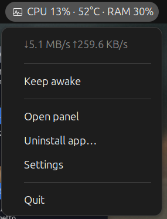
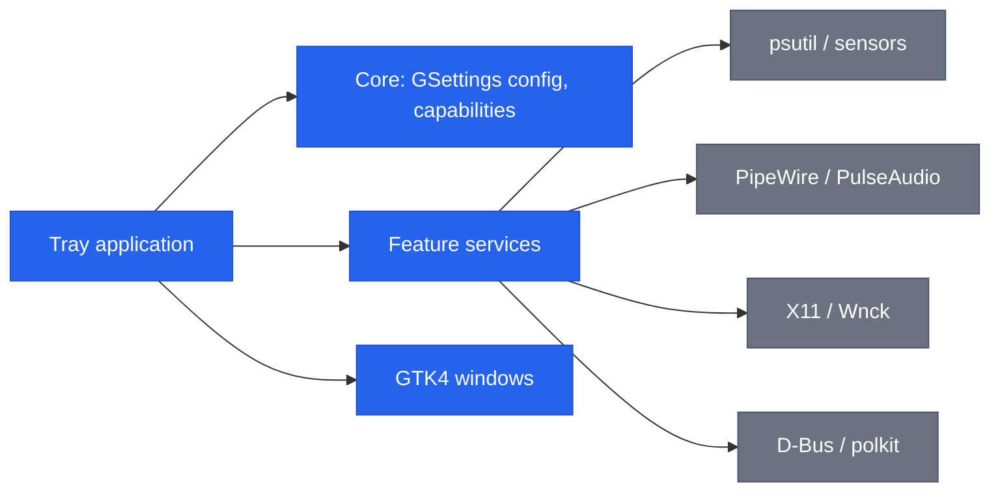

[English](README.md) | **Italiano**

```
███████╗██╗   ██╗███████╗██████╗  █████╗ ██████╗
██╔════╝╚██╗ ██╔╝██╔════╝██╔══██╗██╔══██╗██╔══██╗
███████╗ ╚████╔╝ ███████╗██████╔╝███████║██████╔╝
╚════██║  ╚██╔╝  ╚════██║██╔══██╗██╔══██║██╔══██╗
███████║   ██║   ███████║██████╔╝██║  ██║██║  ██║
╚══════╝   ╚═╝   ╚══════╝╚═════╝ ╚═╝  ╚═╝╚═╝  ╚═╝
```

# Sysbar

Un'applicazione nella barra di sistema di Ubuntu/GNOME che raggruppa utility locali dietro una sola icona.


[](https://github.com/AndreaBonn/sysbar/actions/workflows/ci.yml)
[](https://github.com/AndreaBonn/sysbar/actions/workflows/ci.yml)

Sysbar mette gli strumenti dietro una sola icona nel tray: un monitor di sistema
con sparkline storiche, un mixer del volume per applicazione con selettore
dispositivo audio, una cronologia degli appunti, scorciatoie globali
configurabili, scene componibili, keep awake, auto-quit, un disinstallatore di
applicazioni e uno shelf. Tutto gira in locale: nessun account, nessuna
telemetria. Ogni funzionalità è disattivata finché non la attivi, e si degrada
con un messaggio esplicito quando manca una dipendenza di sistema o una capability
della sessione.



## Indice

- [Funzionalità](#funzionalità)
  - [Monitor di sistema](#monitor-di-sistema)
  - [Mixer del volume per applicazione](#mixer-del-volume-per-applicazione)
  - [Keep awake](#keep-awake)
  - [Auto-quit, disinstallatore e shelf](#auto-quit-disinstallatore-e-shelf)
  - [Scorciatoie globali](#scorciatoie-globali)
  - [Controllo da riga di comando e D-Bus](#controllo-da-riga-di-comando-e-d-bus)
  - [Scene](#scene)
  - [Cronologia degli appunti](#cronologia-degli-appunti)
- [Stack tecnologico](#stack-tecnologico)
- [Architettura](#architettura)
- [Struttura del repository](#struttura-del-repository)
- [Prerequisiti](#prerequisiti)
- [Installazione](#installazione)
- [Configurazione](#configurazione)
- [Esecuzione locale](#esecuzione-locale)
- [Testing](#testing)
- [Deploy e CI/CD](#deploy-e-cicd)
- [Come contribuire](#come-contribuire)
- [Sicurezza](#sicurezza)
- [Licenza](#licenza)
- [Supporta il progetto](#supporta-il-progetto)

## Funzionalità

### Monitor di sistema

Metriche live di CPU, RAM, disco, rete, temperatura e alimentazione. Ogni
metrica può essere collocata singolarmente nella barra sempre visibile, nel menu
a tendina, oppure nascosta. Le metriche per hardware non rilevato sul sistema
(GPU, batteria, alimentazione) sono disabilitate con una nota esplicativa invece
di non mostrare nulla.

Il pannello può mostrare sparkline storiche per ciascuna metrica (CPU, GPU,
memoria, rete, alimentazione, batteria), attivabili singolarmente nelle
impostazioni. Una sezione "rete per processo" elenca i processi che consumano
piu banda; usa `/proc` e `ss` e funziona in modalità best-effort - richiede che
`ss` sia installato e potrebbe non rilevare tutto il traffico in tutte le
configurazioni.


### Mixer del volume per applicazione

Volume e mute indipendenti per ogni applicazione in esecuzione, tramite PipeWire
o PulseAudio. Il mixer compare nel pannello e si aggiorna man mano che le
applicazioni aprono e chiudono stream audio. Il pannello include anche un
selettore rapido per il dispositivo di uscita e di ingresso predefinito, cosi da
cambiare l'hardware audio senza aprire le impostazioni audio di sistema.


### Keep awake

Inibisce sospensione, idle e chiusura del coperchio. Supporta una durata
opzionale, un countdown nel tray e una soglia di batteria che termina la
sessione quando la carica scende troppo. Può essere attivato con una scorciatoia
globale configurabile (vedi Scorciatoie globali di seguito).


### Auto-quit, disinstallatore e shelf

- **Auto-quit**: chiude automaticamente le applicazioni tracciate, con
  escalation graduale `SIGTERM` poi `SIGKILL` e una lista di eccezioni. Traccia
  le finestre tramite libwnck su X11 e tramite la GNOME Shell extension inclusa
  su Wayland (vedi [Installazione](#installazione)).
- **Disinstallatore**: rimuove le applicazioni desktop e i loro file residui; la
  rimozione del pacchetto è protetta da polkit.
- **Shelf**: un'area temporanea dove trascinare file, link, testo e immagini, con
  persistenza tra le sessioni e un gesto opzionale shake-to-open.


### Scorciatoie globali

Dalle impostazioni è possibile assegnare scorciatoie da tastiera a piu azioni:
attivare keep awake, aprire lo shelf, aprire la cronologia degli appunti e
attivare la scena Focus. Le scorciatoie vengono registrate tramite il portale
XDG GlobalShortcuts e funzionano su tutto il desktop, non solo quando Sysbar ha
il focus, sia su X11 sia su Wayland.

### Controllo da riga di comando e D-Bus

Ogni azione disponibile dal menu tray è esposta anche come action group GTK
sul session bus (`org.gtk.Actions` su `io.github.AndreaBonn.Sysbar`, object
path `/io/github/AndreaBonn/Sysbar`), che la CLI usa sotto il cofano:

```bash
sysbar <azione> [argomento]
```

Il comando inoltra l'azione all'istanza già in esecuzione e termina; non avvia
Sysbar. Se nessuna istanza è attiva, stampa un errore su stderr ed esce con
codice 1. Un'azione inesistente esce con codice 2 ed elenca quelle valide.

Per il catalogo completo delle azioni:

```bash
sysbar --list-actions
```

Le azioni disponibili sono 13: `open-panel`, `open-settings`, `open-shelf`,
`open-clipboard`, `open-uninstaller`, `toggle-keep-awake`,
`toggle-microphone`, `toggle-dnd`, `toggle-dark-mode`, `toggle-focus-scene`,
`activate-scene` (richiede l'id di una scena come argomento: `focus`,
`presentation` o `power-saving`), `clear-scene`, `quit`.

Le azioni legate a una capability non disponibile nella sessione corrente (per
esempio `toggle-microphone` senza PipeWire, o `open-shelf` con lo shelf
disattivato nelle impostazioni) restano registrate ma disabilitate: il nome
resta stabile per chi scrive script, l'invocazione semplicemente non fa nulla.

Esempi:

```bash
sysbar open-panel
sysbar activate-scene focus
sysbar --list-actions
```

Utile per assegnare un'azione a una scorciatoia personalizzata di GNOME,
richiamarla da uno script o da un job systemd, oppure da un window manager
come sway o i3.

### Scene

Tre scene componibili sono disponibili dal sottomenu "Scenes" nel tray. Ogni
scena attiva una combinazione di impostazioni con un solo clic:

- **Focus** - attiva keep awake, abilita il non-disturbare, silenzia il
  microfono.
- **Presentation** - attiva keep awake, abilita il non-disturbare.
- **Power saving** - disattiva keep awake, riduce le impostazioni del display
  per risparmiare energia.

Le scene possono essere attivate anche tramite scorciatoia globale.

### Cronologia degli appunti

Un gestore degli appunti che mantiene una cronologia ricercabile dei testi
copiati. Le voci possono essere fissate in cima all'elenco, e cliccarne una la
copia di nuovo negli appunti. La cronologia è accessibile dal menu tray e da una
scorciatoia globale configurabile. La funzionalità è disattivata per impostazione
predefinita e va abilitata nelle impostazioni.

Nota sulla privacy: la cronologia degli appunti è salvata in chiaro su disco.
Non abilitarla se copi regolarmente dati sensibili come password o token.

## Stack tecnologico

| Livello | Componenti |
|---|---|
| Linguaggio | Python 3.11+ |
| UI | GTK 4, libadwaita (PyGObject) |
| Tray | AyatanaAppIndicator3 con StatusNotifier e DBusMenu |
| Accesso al sistema | psutil, libwnck (X11), python-xlib, pulsectl, pynvml opzionale (NVIDIA), GNOME Shell extension (auto-quit su Wayland) |
| Configurazione | GSettings (schema GLib `io.github.AndreaBonn.Sysbar`) |
| Build | hatchling, uv |
| Packaging | Debian `.deb`, repository APT `reprepro` |
| QA | ruff, mypy (strict), pytest con coverage |

## Architettura

Sysbar segue un'organizzazione ports-and-adapters. La logica delle feature vive
in `services/`, framework-agnostica e testabile in isolamento; i confini di
sistema (psutil, PipeWire, X11, D-Bus) stanno dietro adapter e vengono mockati
nei test.



Ogni feature viene cablata in `app/application.py` all'avvio e attivata in base
alle capability rilevate per la sessione in corso (per esempio, il mixer richiede
PipeWire/PulseAudio, e l'auto-quit usa libwnck su X11 oppure la GNOME Shell
extension inclusa su Wayland).

## Struttura del repository

```text
src/sysbar/
  app/        ciclo di vita, tray, rendering metriche
  core/       config GSettings, rilevamento capability, i18n, logging
  services/   logica feature framework-agnostica (ports + adapter)
  ui/         finestre GTK4: pannello, settings, onboarding, shelf, disinstallatore
  support/    diagnostica (selftest, dump sensori)
tests/        mirror di src/sysbar
data/         schema GSettings, file .desktop, autostart, icone app, GNOME Shell extension, traduzioni
packaging/    sorgenti .deb Debian e repository APT
assets/       screenshot
```

## Prerequisiti

- Ubuntu/GNOME, su sessione X11 oppure Wayland. La maggior parte delle feature
  funziona su entrambe; su Wayland l'auto-quit richiede in più la GNOME Shell
  extension inclusa, attivata (il `.deb` la installa, vedi
  [Installazione](#installazione))
- Python 3.11+
- Binding GTK di sistema: `python3-gi`, `gir1.2-gtk-4.0`, `gir1.2-adw-1`,
  `gir1.2-ayatanaappindicator3-0.1`, `gir1.2-wnck-3.0`
- `uv` per l'ambiente Python (solo per l'installazione da sorgente)

Il pacchetto `.deb` trascina questi binding di sistema come dipendenze, quindi
gli utenti finali non devono installarli a mano.

## Installazione

### Per utenti finali (.deb)

È il modo consigliato per installare Sysbar. Il pacchetto include tutto il
necessario e trascina i binding GTK di sistema come dipendenze.

**Passo 1 - Scarica il pacchetto**

Apri l'[ultima release](https://github.com/AndreaBonn/sysbar/releases/latest) e
scarica l'asset `sysbar_<versione>_all.deb` (per esempio
`sysbar_1.1.1_all.deb`).

**Passo 2 - Installalo**

Dalla cartella dove l'hai scaricato, esegui (sostituisci la versione con il file
che hai scaricato):

```bash
sudo apt install ./sysbar_1.1.1_all.deb
```

`apt` risolve in automatico i binding GTK di sistema. Evita `sudo dpkg -i`: non
installa le dipendenze.

Il pacchetto configura:

- un ambiente virtuale Python isolato in `/opt/sysbar` (creato con
  `--system-site-packages`, così riusa i binding GTK di sistema);
- un launcher `/usr/bin/sysbar`;
- l'icona dell'applicazione brandizzata, registrata nel tema delle icone così che
  il pannello, la finestra delle impostazioni e la dock mostrino il logo Sysbar
  al posto del generico ingranaggio GNOME;
- un avvio automatico al login, disattivabile dalle impostazioni;
- una GNOME Shell extension usata dall'auto-quit su Wayland (attivata al passo 4).

**Passo 3 - Avvia Sysbar**

Aprila dal menu applicazioni, oppure esegui `sysbar` in un terminale. L'icona
nel tray compare nella barra superiore. Al primo avvio un onboarding ti
accompagna tra le funzionalità; puoi rieseguirlo e controllare la versione
installata dalla scheda About.


**Passo 4 - Solo su Wayland: attiva l'extension per l'auto-quit**

Su una sessione X11 funziona tutto da subito. Su una sessione Wayland l'auto-quit
richiede la GNOME Shell extension inclusa, che il pacchetto installa a livello di
sistema ma che va attivata una volta per ogni utente:

```bash
gnome-extensions enable sysbar-window-manager@andreabonn.github.io
```

Poi disconnettiti e riaccedi, così GNOME carica l'extension all'avvio della
sessione. Puoi attivarla anche dall'app Estensioni. Tutte le altre funzionalità,
incluse le scorciatoie globali, funzionano già su Wayland senza l'extension.

Non sai su quale sessione sei? Controlla con:

```bash
echo $XDG_SESSION_TYPE   # stampa "x11" o "wayland"
```

#### Aggiornamento

Scarica il `.deb` più recente dalla pagina delle release e installalo come al
passo 2; sostituisce la versione precedente. Le impostazioni vivono in GSettings
e si conservano tra un aggiornamento e l'altro.

#### Disinstallazione

```bash
sudo apt remove sysbar
```

### Da sorgente (sviluppo)

```bash
git clone https://github.com/AndreaBonn/sysbar.git
cd sysbar
uv sync
./build.sh run
```

`build.sh` compila lo schema GSettings e le traduzioni, poi esegue l'app contro
la directory di build locale.

## Configurazione

Tutta la configurazione runtime vive in GSettings, schema
`io.github.AndreaBonn.Sysbar`, path `/io/github/AndreaBonn/Sysbar/`. Le chiavi sono
documentate in `data/io.github.AndreaBonn.Sysbar.gschema.xml`. In produzione non
servono secret né variabili d'ambiente. Le impostazioni sono raggruppate in una
finestra Preferenze con una scheda per area.

### Preferenze generali

Lingua dell'interfaccia, avvio al login e il controllo aggiornamenti opzionale.


### Collocazione delle metriche nel tray

Ogni metrica va nella barra sempre visibile, nel menu a tendina o disattivata;
qui si configurano anche intervallo di campionamento, unità di temperatura e
stile della memoria.


Le variabili in `.env.example` servono solo a sviluppo e diagnostica:

| Nome | Richiesta | Descrizione |
|---|---|---|
| `SYSBAR_LOG_LEVEL` | ⚠️ | Livello di log: `DEBUG`, `INFO`, `WARNING`, `ERROR`, `CRITICAL` |
| `SYSBAR_LOG_FORMAT` | ⚠️ | Formato log: `human` (sviluppo) o `json` (produzione) |
| `GSETTINGS_SCHEMA_DIR` | ⚠️ | Directory dello schema compilato, per eseguire senza installare il `.deb` (impostata in automatico da `build.sh`) |

## Esecuzione locale

```bash
./build.sh build          # compila lo schema GSettings e le traduzioni
./build.sh run            # compila, poi avvia l'app
./build.sh deb            # costruisce il pacchetto .deb (richiede dpkg-dev, debhelper)
```

È disponibile un self-test che esercita i confini di sistema su una sessione
reale:

```bash
./build.sh run -- --selftest
```

## Testing

I test girano con pytest:

```bash
uv run pytest
```

La coverage copre la logica di business framework-agnostica (sanitizzazione
configurazione, rilevamento capability, formattazione log). I confini di sistema
(psutil, pulsectl, X11, D-Bus) stanno dietro interfacce e vengono mockati. In CI
gira una batteria di smoke test che costruiscono le finestre sotto un display
virtuale (`xvfb`), per intercettare alberi di widget rotti; il comportamento più
approfondito della UI resta verificabile manualmente con `--selftest` su una
sessione reale.

Gli smoke test della UI girano in un interprete separato, perché GTK 4 (i
pannelli) e GTK 3 (caricato da libwnck nei test di auto-quit) non possono
coesistere nello stesso processo:

```bash
xvfb-run -a uv run pytest tests/ui -o addopts=""
```

Lint e type check:

```bash
uv run ruff check .
uv run ruff format --check .
uv run mypy
```

## Deploy e CI/CD

Il workflow CI (`.github/workflows/ci.yml`) gira su `ubuntu-24.04` a ogni push su
`main` e a ogni pull request. Installa i binding GI di sistema, crea un ambiente
virtuale `--system-site-packages`, poi esegue ruff lint, ruff format check, mypy,
la suite di test e gli smoke test delle finestre GTK sotto `xvfb`.

Le release distribuiscono il `.deb` come asset di release GitHub. Gli
aggiornamenti possono passare anche da un repository APT firmato; vedi
`packaging/apt-repo/README.md`.

## Come contribuire

Issue e pull request sono benvenute su
[GitHub](https://github.com/AndreaBonn/sysbar). Prima di aprire una pull request,
esegui in locale `uv run ruff check .`, `uv run mypy` e `uv run pytest`; la CI
esegue gli stessi controlli. Mantieni i commit mirati e usa il formato
[Conventional Commits](https://www.conventionalcommits.org/).

## Sicurezza

Per segnalare una vulnerabilità, consulta [SECURITY.it.md](./SECURITY.it.md).

## Licenza

Distribuito sotto licenza GNU General Public License v3.0 o successiva. Vedi
[LICENSE](./LICENSE).

## Supporta il progetto

Se Sysbar ti è utile, lascia una stella su
[GitHub](https://github.com/AndreaBonn/sysbar). Aiuta altri a scoprirlo.

Sysbar è gratuita. Se ti è utile e vuoi contribuire, puoi lasciare un'offerta
tramite PayPal. L'importo lo scegli tu ed è del tutto facoltativo.

<div align="center">

[](https://paypal.me/AndreaBonacci19)

</div>
