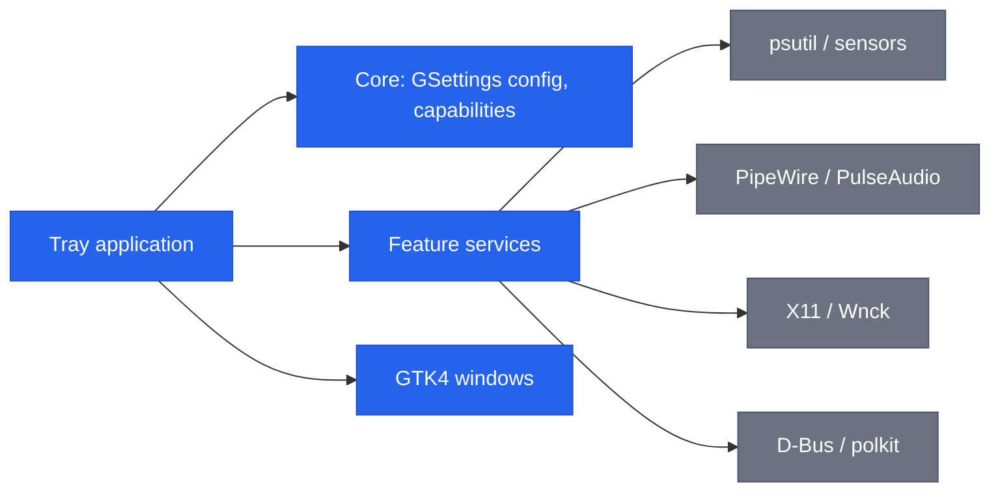

[English](README.md) | **Italiano**

```
███████╗██╗   ██╗███████╗██████╗  █████╗ ██████╗
██╔════╝╚██╗ ██╔╝██╔════╝██╔══██╗██╔══██╗██╔══██╗
███████╗ ╚████╔╝ ███████╗██████╔╝███████║██████╔╝
╚════██║  ╚██╔╝  ╚════██║██╔══██╗██╔══██║██╔══██╗
███████║   ██║   ███████║██████╔╝██║  ██║██║  ██║
╚══════╝   ╚═╝   ╚══════╝╚═════╝ ╚═╝  ╚═╝╚═╝  ╚═╝
```

# Sysbar

Una singola applicazione nella barra di sistema di Ubuntu/GNOME che raggruppa
sei utility locali.


[](https://github.com/AndreaBonn/sysbar/actions/workflows/ci.yml)
[](https://github.com/AndreaBonn/sysbar/actions/workflows/ci.yml)

Sysbar mette sei strumenti dietro una sola icona nel tray: un monitor di sistema,
un mixer del volume per applicazione, keep awake, auto-quit, un disinstallatore di
applicazioni e uno shelf. Tutto gira in locale: nessun account, nessuna
telemetria. Ogni feature è disattivata finché non la attivi, e si degrada con un
messaggio esplicito quando manca una dipendenza di sistema o una capability della
sessione.


## Indice

- [Funzionalità](#funzionalità)
- [Stack tecnologico](#stack-tecnologico)
- [Architettura](#architettura)
- [Struttura del repository](#struttura-del-repository)
- [Prerequisiti](#prerequisiti)
- [Installazione](#installazione)
- [Configurazione](#configurazione)
- [Esecuzione locale](#esecuzione-locale)
- [Testing](#testing)
- [Deploy e CI/CD](#deploy-e-cicd)
- [Come contribuire](#come-contribuire)
- [Sicurezza](#sicurezza)
- [Licenza](#licenza)
- [Supporta il progetto](#supporta-il-progetto)

## Funzionalità

### Monitor di sistema

Metriche live di CPU, RAM, disco, rete, temperatura e alimentazione. Ogni
metrica può essere collocata singolarmente nella barra sempre visibile, nel menu
a tendina, oppure nascosta. Le metriche per hardware non rilevato sul sistema
(GPU, batteria, alimentazione) sono disabilitate con una nota esplicativa invece
di non mostrare nulla.


### Mixer del volume per applicazione

Volume e mute indipendenti per ogni applicazione in esecuzione, tramite PipeWire
o PulseAudio. Il mixer compare nel pannello e si aggiorna man mano che le
applicazioni aprono e chiudono stream audio.


### Keep awake

Inibisce sospensione, idle e chiusura del coperchio. Supporta una durata
opzionale, una scorciatoia globale, un countdown nel tray e una soglia di
batteria che termina la sessione quando la carica scende troppo.


### Auto-quit, disinstallatore e shelf

- **Auto-quit**: chiude automaticamente le applicazioni tracciate, con
  escalation graduale `SIGTERM` poi `SIGKILL` e una lista di eccezioni.
- **Disinstallatore**: rimuove le applicazioni desktop e i loro file residui; la
  rimozione del pacchetto è protetta da polkit.
- **Shelf**: un'area temporanea dove trascinare file, link, testo e immagini, con
  persistenza tra le sessioni e un gesto opzionale shake-to-open.


## Stack tecnologico

| Livello | Componenti |
|---|---|
| Linguaggio | Python 3.11+ |
| UI | GTK 4, libadwaita (PyGObject) |
| Tray | AyatanaAppIndicator3 con StatusNotifier e DBusMenu |
| Accesso al sistema | psutil, libwnck, python-xlib, pulsectl, pynvml opzionale (NVIDIA) |
| Configurazione | GSettings (schema GLib `io.github.AndreaBonn.Sysbar`) |
| Build | hatchling, uv |
| Packaging | Debian `.deb`, repository APT `reprepro` |
| QA | ruff, mypy (strict), pytest con coverage |

## Architettura

Sysbar segue un'organizzazione ports-and-adapters. La logica delle feature vive
in `services/`, framework-agnostica e testabile in isolamento; i confini di
sistema (psutil, PipeWire, X11, D-Bus) stanno dietro adapter e vengono mockati
nei test.



Ogni feature viene cablata in `app/application.py` all'avvio e attivata in base
alle capability rilevate per la sessione in corso (per esempio, il mixer richiede
PipeWire/PulseAudio e l'auto-quit richiede una sessione X11).

## Struttura del repository

```text
src/sysbar/
  app/        ciclo di vita, tray, rendering metriche
  core/       config GSettings, rilevamento capability, i18n, logging
  services/   logica feature framework-agnostica (ports + adapter)
  ui/         finestre GTK4: pannello, settings, onboarding, shelf, disinstallatore
  support/    diagnostica (selftest, dump sensori)
tests/        mirror di src/sysbar
data/         schema GSettings, file .desktop, autostart, traduzioni
packaging/    sorgenti .deb Debian e repository APT
assets/       screenshot
```

## Prerequisiti

- Ubuntu/GNOME su sessione X11 (alcune feature richiedono X11; su Wayland l'app
  si avvia e disattiva quelle non supportate)
- Python 3.11+
- Binding GTK di sistema: `python3-gi`, `gir1.2-gtk-4.0`, `gir1.2-adw-1`,
  `gir1.2-ayatanaappindicator3-0.1`, `gir1.2-wnck-3.0`
- `uv` per l'ambiente Python (solo per l'installazione da sorgente)

Il pacchetto `.deb` trascina questi binding di sistema come dipendenze, quindi
gli utenti finali non devono installarli a mano.

## Installazione

### Per utenti finali (.deb)

Scarica `sysbar_<versione>_all.deb` dall'ultima release
([github.com/AndreaBonn/sysbar/releases/latest](https://github.com/AndreaBonn/sysbar/releases/latest))
e installalo con `apt`, che risolve in automatico i binding GTK di sistema:

```bash
sudo apt install ./sysbar_0.3.0_all.deb
```

Avvia dal menu applicazioni o con `sysbar`. Per rimuovere:

```bash
sudo apt remove sysbar
```

Il pacchetto installa un ambiente virtuale isolato in `/opt/sysbar` (con
`--system-site-packages`, così riusa i binding GTK di sistema) e un wrapper
`/usr/bin/sysbar`. Registra anche un avvio automatico al login, disattivabile
dalle impostazioni.

Al primo avvio un onboarding ti accompagna tra le funzionalità. Puoi rieseguirlo
e controllare la versione installata dalla scheda About.


### Da sorgente (sviluppo)

```bash
git clone https://github.com/AndreaBonn/sysbar.git
cd sysbar
uv sync
./build.sh run
```

`build.sh` compila lo schema GSettings e le traduzioni, poi esegue l'app contro
la directory di build locale.

## Configurazione

Tutta la configurazione runtime vive in GSettings, schema
`io.github.AndreaBonn.Sysbar`, path `/io/github/AndreaBonn/Sysbar/`. Le chiavi sono
documentate in `data/io.github.AndreaBonn.Sysbar.gschema.xml`. In produzione non
servono secret né variabili d'ambiente. Le impostazioni sono raggruppate in una
finestra Preferenze con una scheda per area.

### Preferenze generali

Lingua dell'interfaccia, avvio al login e il controllo aggiornamenti opzionale.


### Collocazione delle metriche nel tray

Ogni metrica va nella barra sempre visibile, nel menu a tendina o disattivata;
qui si configurano anche intervallo di campionamento, unità di temperatura e
stile della memoria.


Le variabili in `.env.example` servono solo a sviluppo e diagnostica:

| Nome | Richiesta | Descrizione |
|---|---|---|
| `SYSBAR_LOG_LEVEL` | ⚠️ | Livello di log: `DEBUG`, `INFO`, `WARNING`, `ERROR`, `CRITICAL` |
| `SYSBAR_LOG_FORMAT` | ⚠️ | Formato log: `human` (sviluppo) o `json` (produzione) |
| `GSETTINGS_SCHEMA_DIR` | ⚠️ | Directory dello schema compilato, per eseguire senza installare il `.deb` (impostata in automatico da `build.sh`) |

## Esecuzione locale

```bash
./build.sh build          # compila lo schema GSettings e le traduzioni
./build.sh run            # compila, poi avvia l'app
./build.sh deb            # costruisce il pacchetto .deb (richiede dpkg-dev, debhelper)
```

È disponibile un self-test che esercita i confini di sistema su una sessione
reale:

```bash
./build.sh run -- --selftest
```

## Testing

I test girano con pytest:

```bash
uv run pytest
```

La coverage copre la logica di business framework-agnostica (sanitizzazione
configurazione, rilevamento capability, formattazione log). I confini di sistema
(psutil, pulsectl, X11, D-Bus) stanno dietro interfacce e vengono mockati. La UI
GTK non è testata in CI: è verificabile manualmente con `--selftest` su una
sessione reale.

Lint e type check:

```bash
uv run ruff check .
uv run ruff format --check .
uv run mypy
```

## Deploy e CI/CD

Il workflow CI (`.github/workflows/ci.yml`) gira su `ubuntu-24.04` a ogni push su
`main` e a ogni pull request. Installa i binding GI di sistema, crea un ambiente
virtuale `--system-site-packages`, poi esegue ruff lint, ruff format check, mypy
e pytest.

Le release distribuiscono il `.deb` come asset di release GitHub. Gli
aggiornamenti possono passare anche da un repository APT firmato; vedi
`packaging/apt-repo/README.md`.

## Come contribuire

Issue e pull request sono benvenute su
[GitHub](https://github.com/AndreaBonn/sysbar). Prima di aprire una pull request,
esegui in locale `uv run ruff check .`, `uv run mypy` e `uv run pytest`; la CI
esegue gli stessi controlli. Mantieni i commit mirati e usa il formato
[Conventional Commits](https://www.conventionalcommits.org/).

## Sicurezza

Per segnalare una vulnerabilità, consulta [SECURITY.it.md](./SECURITY.it.md).

## Licenza

Distribuito sotto licenza GNU General Public License v3.0 o successiva. Vedi
[LICENSE](./LICENSE).

## Supporta il progetto

Se Sysbar ti è utile, lascia una stella su
[GitHub](https://github.com/AndreaBonn/sysbar). Aiuta altri a scoprirlo.

Sysbar è gratuita. Se ti è utile e vuoi contribuire, puoi lasciare un'offerta
tramite PayPal. L'importo lo scegli tu ed è del tutto facoltativo.

<div align="center">

[](https://paypal.me/AndreaBonacci19)

</div>
