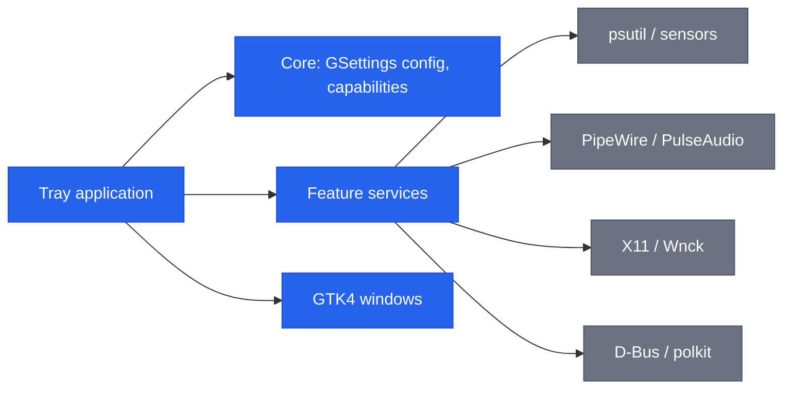

**English** | [Italiano](README.it.md)

```
███████╗██╗   ██╗███████╗██████╗  █████╗ ██████╗
██╔════╝╚██╗ ██╔╝██╔════╝██╔══██╗██╔══██╗██╔══██╗
███████╗ ╚████╔╝ ███████╗██████╔╝███████║██████╔╝
╚════██║  ╚██╔╝  ╚════██║██╔══██╗██╔══██║██╔══██╗
███████║   ██║   ███████║██████╔╝██║  ██║██║  ██║
╚══════╝   ╚═╝   ╚══════╝╚═════╝ ╚═╝  ╚═╝╚═╝  ╚═╝
```

# Sysbar

A Ubuntu/GNOME system tray application that bundles local utilities behind one icon.


[](https://github.com/AndreaBonn/sysbar/actions/workflows/ci.yml)
[](https://github.com/AndreaBonn/sysbar/actions/workflows/ci.yml)

Sysbar puts tools behind one tray icon: a system monitor with historical
sparklines, a per-application volume mixer with output/input device switching,
a clipboard history manager, configurable global hotkeys, composable scenes, keep
awake, auto-quit, an application uninstaller and a shelf. Everything runs
locally: no account, no telemetry. Every feature is off until you turn it on,
and degrades with an explicit message when a system dependency or session
capability is missing.


## Table of contents

- [Features](#features)
  - [System monitor](#system-monitor)
  - [Per-application volume mixer](#per-application-volume-mixer)
  - [Keep awake](#keep-awake)
  - [Auto-quit, uninstaller and shelf](#auto-quit-uninstaller-and-shelf)
  - [Global hotkeys](#global-hotkeys)
  - [Command palette](#command-palette)
  - [Command-line and D-Bus control](#command-line-and-d-bus-control)
  - [Scenes](#scenes)
  - [Clipboard history](#clipboard-history)
- [Tech stack](#tech-stack)
- [Architecture](#architecture)
- [Repository structure](#repository-structure)
- [Prerequisites](#prerequisites)
- [Installation](#installation)
- [Configuration](#configuration)
- [Running locally](#running-locally)
- [Testing](#testing)
- [Deployment and CI/CD](#deployment-and-cicd)
- [Contributing](#contributing)
- [Security](#security)
- [License](#license)
- [Support the project](#support-the-project)

## Features

### System monitor

Live CPU, RAM, disk, network, temperature and power metrics. Each metric can be
placed individually in the always-visible bar, in the dropdown menu, or hidden.
Metrics for hardware not detected on the system (GPU, battery, power) are
disabled with an explanatory note instead of showing nothing.

The panel can show historical sparklines for each metric (CPU, GPU, memory,
network, power, battery), toggled per metric in settings. A "network per process"
section lists the processes consuming the most bandwidth; it uses `/proc` and `ss`
and works on a best-effort basis - it requires `ss` to be present and may not
reflect all traffic on all configurations.


### Per-application volume mixer

Independent volume and mute per running application, over PipeWire or
PulseAudio. The mixer appears in the panel and updates as applications open and
close audio streams. The panel also includes a quick selector for the default
output and input device, so you can switch audio hardware without opening the
system sound settings.


### Keep awake

Inhibits sleep, idle and lid suspension. Supports an optional duration, a tray
countdown and a battery threshold that ends the session when the charge drops too
low. Can be toggled with a configurable global hotkey (see Global hotkeys below).


### Auto-quit, uninstaller and shelf

- **Auto-quit**: closes tracked applications automatically, with a graceful
  `SIGTERM` then `SIGKILL` escalation and an exception list. It tracks windows
  through libwnck on X11 and through the bundled GNOME Shell extension on
  Wayland (see [Installation](#installation)).
- **Uninstaller**: removes desktop applications and their leftover files;
  package removal is gated behind polkit.
- **Shelf**: a temporary drop area for files, links, text and images, with
  persistence across sessions and an optional shake-to-open gesture.


### Global hotkeys

Keyboard shortcuts can be assigned to several actions from the settings: toggle
keep awake, open the shelf, open the clipboard history, open the command
palette, and activate the Focus scene. Shortcuts are registered through the
XDG GlobalShortcuts portal and work across the desktop on both X11 and
Wayland, not just when Sysbar has focus.

### Command palette

A single window, opened with a global hotkey, for finding and running
anything in Sysbar without navigating the tray menu or settings. It searches
commands, quick toggles, scenes, clipboard history entries, shelf items and
audio output/input devices with one fuzzy search: matching is
case-insensitive, accent-insensitive, and works on partial or out-of-order
letters, scored so the closest match comes first. Clearing the search box
shows the main commands grouped by category.

Type to search, use the arrow keys to move through the results, Enter to run
the selected item, Esc to close. The window is focused on the search field as
soon as it opens, and closes if it loses focus. Clipboard entries flagged as a
likely secret (a password or token) are masked by default and need an
explicit action to reveal.

Off by default; enable it from the global hotkeys settings described above.

### Command-line and D-Bus control

Every action available from the tray menu is also exposed as a GTK action
group on the session bus (`org.gtk.Actions` on `io.github.AndreaBonn.Sysbar`,
object path `/io/github/AndreaBonn/Sysbar`), and the CLI wraps it for
convenience:

```bash
sysbar <action> [argument]
```

This forwards the action to the already-running instance and exits; it does
not start Sysbar. If no instance is running, it prints an error to stderr and
exits with status 1. An unknown action exits with status 2 and lists the valid
ones.

List the full catalog of actions:

```bash
sysbar --list-actions
```

There are 15 actions: `open-panel`, `open-palette`, `open-scenes`,
`open-settings`, `open-shelf`, `open-clipboard`, `open-uninstaller`,
`toggle-keep-awake`, `toggle-microphone`, `toggle-dnd`, `toggle-dark-mode`,
`toggle-focus-scene`, `activate-scene` (takes a scene id as argument, for
example `focus`, `presentation` or `power-saving`, or the id of a scene you
created), `clear-scene`, `quit`.

Actions tied to a capability unavailable in the current session (for example
`toggle-microphone` without PipeWire, or `open-shelf` with the shelf disabled
in settings) stay registered but disabled: the name stays stable for scripts,
the invocation simply does nothing.

Examples:

```bash
sysbar open-panel
sysbar activate-scene focus
sysbar --list-actions
```

This is useful to bind an action to a custom GNOME keyboard shortcut, to call
it from a script or a systemd job, or from a window manager such as sway or
i3.

### Scenes

A scene applies a combination of settings in one click, from a "Scenes"
submenu in the tray or from the Scenes window, where scenes are created,
edited and deleted. Three scenes come built in - Focus, Presentation and
Power saving - and cannot be deleted, but editing one creates a restorable
override so your changes persist without losing the original:

- **Focus** - enables keep awake, turns on do-not-disturb, mutes the microphone.
- **Presentation** - enables keep awake, turns on do-not-disturb.
- **Power saving** - disables keep awake, adjusts display settings to reduce
  power use.

A scene you create is a list of actions, each of one of three kinds: toggle a
system switch (keep awake, do-not-disturb, microphone), set one of
a fixed list of allowed settings, or choose the default audio output device.
Scenes are stored in `~/.local/share/sysbar/scenes/manifest.json`, readable
only by your user.

Scenes can be activated by hand from the tray or the Scenes window, by a
global hotkey (Focus only, see Global hotkeys above), or automatically by a
trigger: connecting an external monitor, or a change in power source or
battery level. Automatic triggers are off by default and configured per
scene in the scene editor; restoring the previous scene once the trigger
condition ends is optional and set per rule. A scene you activate by hand is
never overridden by a trigger.

### Clipboard history

A clipboard manager that keeps a searchable history of copied text. Entries can
be pinned to keep them at the top, and clicking any entry copies it back to the
clipboard. The history is accessible from the tray menu and from a configurable
global hotkey. The feature is off by default and must be enabled in settings.

Note on privacy: the clipboard history is stored in plain text on disk. Do not
enable it if you regularly copy sensitive data such as passwords or tokens.

## Tech stack

| Tier | Components |
|---|---|
| Language | Python 3.11+ |
| UI | GTK 4, libadwaita (PyGObject) |
| Tray | AyatanaAppIndicator3 with StatusNotifier and DBusMenu |
| System access | psutil, libwnck (X11), python-xlib, pulsectl, optional pynvml (NVIDIA), GNOME Shell extension (Wayland auto-quit) |
| Configuration | GSettings (GLib schema `io.github.AndreaBonn.Sysbar`) |
| Build | hatchling, uv |
| Packaging | Debian `.deb`, `reprepro` APT repository |
| QA | ruff, mypy (strict), pytest with coverage |

## Architecture

Sysbar follows a ports-and-adapters layout. Feature logic lives in
`services/`, framework-agnostic and testable in isolation; system boundaries
(psutil, PipeWire, X11, D-Bus) sit behind adapters and are mocked in tests.



Each feature is wired in `app/application.py` at startup and gated on the
capabilities detected for the running session (for example, the mixer requires
PipeWire/PulseAudio, and auto-quit uses libwnck on X11 or the bundled GNOME
Shell extension on Wayland).

## Repository structure

```text
src/sysbar/
  app/        application lifecycle, tray, metric rendering
  core/       GSettings config, capability detection, i18n, logging
  services/   framework-agnostic feature logic (ports + adapters)
  ui/         GTK4 windows: panel, settings, onboarding, shelf, uninstaller
  support/    diagnostics (selftest, sensor dump)
tests/        mirror of src/sysbar
data/         GSettings schema, .desktop files, autostart, app icons, GNOME Shell extension, translations
packaging/    Debian .deb sources and APT repository
assets/       screenshots
```

## Prerequisites

- Ubuntu/GNOME, on either an X11 or a Wayland session. Most features work on
  both; on Wayland, auto-quit additionally needs the bundled GNOME Shell
  extension enabled (the `.deb` installs it, see [Installation](#installation))
- Python 3.11+
- System GTK bindings: `python3-gi`, `gir1.2-gtk-4.0`, `gir1.2-adw-1`,
  `gir1.2-ayatanaappindicator3-0.1`, `gir1.2-wnck-3.0`
- `uv` for the Python environment (source install only)

The `.deb` package pulls these system bindings in as dependencies, so end users
do not need to install them by hand.

## Installation

### For end users (.deb)

This is the recommended way to install Sysbar. The package bundles everything
needed and pulls the GTK system bindings in as dependencies.

**Step 1 - Download the package**

Open the [latest release](https://github.com/AndreaBonn/sysbar/releases/latest)
and download the `sysbar_<version>_all.deb` asset (for example
`sysbar_1.2.0_all.deb`).

**Step 2 - Install it**

From the folder where you downloaded it, run (replace the version with the file
you downloaded):

```bash
sudo apt install ./sysbar_1.2.0_all.deb
```

`apt` resolves the GTK system bindings automatically. Avoid `sudo dpkg -i`: it
does not pull in dependencies.

The package sets up:

- an isolated Python virtual environment under `/opt/sysbar` (created with
  `--system-site-packages`, so it reuses the system GTK bindings);
- a `/usr/bin/sysbar` launcher;
- the branded application icon, registered in the icon theme so the panel, the
  settings window and the dock show the Sysbar logo instead of the generic GNOME
  gear;
- a login autostart entry, which you can disable from the settings;
- a GNOME Shell extension used by auto-quit on Wayland (enabled in step 4).

**Step 3 - Launch Sysbar**

Open it from the applications menu, or run `sysbar` in a terminal. The tray icon
appears in the top bar. On first launch an onboarding walks you through the
features; you can re-run it and check the installed version from the About tab.


**Step 4 - On Wayland only: enable the auto-quit extension**

On an X11 session everything works out of the box. On a Wayland session,
auto-quit needs the bundled GNOME Shell extension, which the package installs
system-wide but which must be enabled once per user:

```bash
gnome-extensions enable sysbar-window-manager@andreabonn.github.io
```

Then log out and back in, so GNOME loads the extension at session start. You can
also enable it from the Extensions app. Every other feature, including the
global hotkeys, already works on Wayland without the extension.

Not sure which session you are on? Check with:

```bash
echo $XDG_SESSION_TYPE   # prints "x11" or "wayland"
```

#### Updating

Download the newer `.deb` from the releases page and install it the same way as
in step 2; it replaces the previous version. Your settings live in GSettings and
are preserved across updates.

#### Uninstalling

```bash
sudo apt remove sysbar
```

### From source (development)

```bash
git clone https://github.com/AndreaBonn/sysbar.git
cd sysbar
uv sync
./build.sh run
```

`build.sh` compiles the GSettings schema and translations, then runs the app
against the local build directory.

## Configuration

All runtime configuration lives in GSettings, schema
`io.github.AndreaBonn.Sysbar`, path `/io/github/AndreaBonn/Sysbar/`. The keys are
documented in `data/io.github.AndreaBonn.Sysbar.gschema.xml`. No secrets or
environment variables are required in production. Settings are grouped in a
Preferences window with one tab per area.

### General preferences

Interface language, start at login and the optional update check.


### Tray metric placement

Each metric goes in the always-visible bar, the dropdown menu, or off; sampling
interval, temperature unit and memory style are configured here too.


The variables in `.env.example` are for development and diagnostics only:

| Name | Required | Description |
|---|---|---|
| `SYSBAR_LOG_LEVEL` | ⚠️ | Log level: `DEBUG`, `INFO`, `WARNING`, `ERROR`, `CRITICAL` |
| `SYSBAR_LOG_FORMAT` | ⚠️ | Log format: `human` (development) or `json` (production) |
| `GSETTINGS_SCHEMA_DIR` | ⚠️ | Compiled schema directory, to run without installing the `.deb` (set automatically by `build.sh`) |

## Running locally

```bash
./build.sh build          # compile the GSettings schema and translations
./build.sh run            # compile, then run the app
./build.sh deb            # build the .deb package (requires dpkg-dev, debhelper)
```

A self-test that exercises the system boundaries on a real session is available:

```bash
./build.sh run -- --selftest
```

## Testing

Tests run with pytest:

```bash
uv run pytest
```

Coverage tracks the framework-agnostic business logic (config sanitization,
capability detection, log formatting). System boundaries (psutil, pulsectl, X11,
D-Bus) sit behind interfaces and are mocked. Window construction smoke tests run
under a virtual display (`xvfb`) in CI to catch broken widget trees; deeper UI
behavior is still verified manually with `--selftest` on a real session.

The UI smoke tests run in their own interpreter, because GTK 4 (the panels) and
GTK 3 (pulled in by libwnck in the auto-quit tests) cannot coexist in one
process:

```bash
xvfb-run -a uv run pytest tests/ui -o addopts=""
```

Lint and type check:

```bash
uv run ruff check .
uv run ruff format --check .
uv run mypy
```

## Deployment and CI/CD

The CI workflow (`.github/workflows/ci.yml`) runs on `ubuntu-24.04` for every
push to `main` and every pull request. It installs the system GI bindings,
creates a `--system-site-packages` virtual environment, then runs ruff lint,
ruff format check, mypy, the test suite and the GTK window smoke tests under
`xvfb`.

Releases ship the `.deb` as a GitHub release asset. Updates can also be
delivered through a signed APT repository; see `packaging/apt-repo/README.md`.

## Contributing

Issues and pull requests are welcome on
[GitHub](https://github.com/AndreaBonn/sysbar). Before opening a pull request,
run `uv run ruff check .`, `uv run mypy` and `uv run pytest` locally; CI runs the
same checks. Keep commits focused and use [Conventional
Commits](https://www.conventionalcommits.org/) for the message format.

## Security

To report a vulnerability, see [SECURITY.md](./SECURITY.md).

## License

Released under the GNU General Public License v3.0 or later. See
[LICENSE](./LICENSE).

## Support the project

If Sysbar is useful to you, consider leaving a star on
[GitHub](https://github.com/AndreaBonn/sysbar). It helps others discover it.

Sysbar is free to use. If it helps you and you want to give something back, you
can leave a tip via PayPal. The amount is up to you and it is entirely optional.

<div align="center">

[](https://paypal.me/AndreaBonacci19)

</div>
