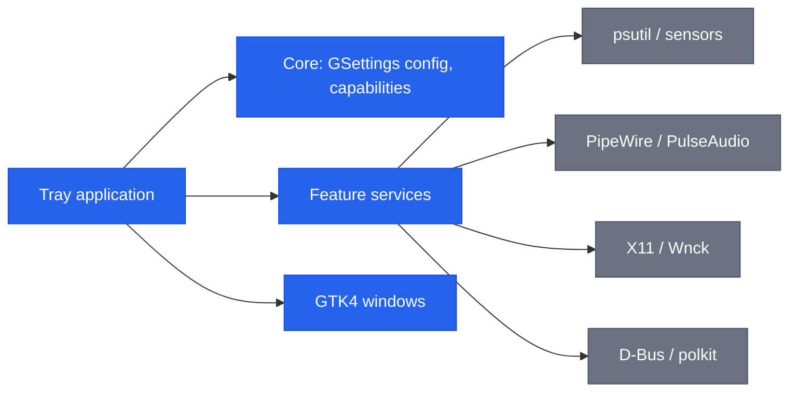

**English** | [Italiano](README.it.md)

```
███████╗██╗   ██╗███████╗██████╗  █████╗ ██████╗
██╔════╝╚██╗ ██╔╝██╔════╝██╔══██╗██╔══██╗██╔══██╗
███████╗ ╚████╔╝ ███████╗██████╔╝███████║██████╔╝
╚════██║  ╚██╔╝  ╚════██║██╔══██╗██╔══██║██╔══██╗
███████║   ██║   ███████║██████╔╝██║  ██║██║  ██║
╚══════╝   ╚═╝   ╚══════╝╚═════╝ ╚═╝  ╚═╝╚═╝  ╚═╝
```

# Sysbar

A single Ubuntu/GNOME system tray application that bundles six local utilities.


[](https://github.com/AndreaBonn/sysbar/actions/workflows/ci.yml)
[](https://github.com/AndreaBonn/sysbar/actions/workflows/ci.yml)

Sysbar puts six tools behind one tray icon: a system monitor, a per-application
volume mixer, keep awake, auto-quit, an application uninstaller and a shelf.
Everything runs locally: no account, no telemetry. Every feature is off until
you turn it on, and degrades with an explicit message when a system dependency
or session capability is missing.


## Table of contents

- [Features](#features)
- [Tech stack](#tech-stack)
- [Architecture](#architecture)
- [Repository structure](#repository-structure)
- [Prerequisites](#prerequisites)
- [Installation](#installation)
- [Configuration](#configuration)
- [Running locally](#running-locally)
- [Testing](#testing)
- [Deployment and CI/CD](#deployment-and-cicd)
- [Contributing](#contributing)
- [Security](#security)
- [License](#license)
- [Support the project](#support-the-project)

## Features

### System monitor

Live CPU, RAM, disk, network, temperature and power metrics. Each metric can be
placed individually in the always-visible bar, in the dropdown menu, or hidden.
Metrics for hardware not detected on the system (GPU, battery, power) are
disabled with an explanatory note instead of showing nothing.


### Per-application volume mixer

Independent volume and mute per running application, over PipeWire or
PulseAudio. The mixer appears in the panel and updates as applications open and
close audio streams.


### Keep awake

Inhibits sleep, idle and lid suspension. Supports an optional duration, a global
hotkey, a tray countdown and a battery threshold that ends the session when the
charge drops too low.


### Auto-quit, uninstaller and shelf

- **Auto-quit**: closes tracked applications automatically, with a graceful
  `SIGTERM` then `SIGKILL` escalation and an exception list.
- **Uninstaller**: removes desktop applications and their leftover files;
  package removal is gated behind polkit.
- **Shelf**: a temporary drop area for files, links, text and images, with
  persistence across sessions and an optional shake-to-open gesture.


## Tech stack

| Tier | Components |
|---|---|
| Language | Python 3.11+ |
| UI | GTK 4, libadwaita (PyGObject) |
| Tray | AyatanaAppIndicator3 with StatusNotifier and DBusMenu |
| System access | psutil, libwnck, python-xlib, pulsectl, optional pynvml (NVIDIA) |
| Configuration | GSettings (GLib schema `io.github.AndreaBonn.Sysbar`) |
| Build | hatchling, uv |
| Packaging | Debian `.deb`, `reprepro` APT repository |
| QA | ruff, mypy (strict), pytest with coverage |

## Architecture

Sysbar follows a ports-and-adapters layout. Feature logic lives in
`services/`, framework-agnostic and testable in isolation; system boundaries
(psutil, PipeWire, X11, D-Bus) sit behind adapters and are mocked in tests.



Each feature is wired in `app/application.py` at startup and gated on the
capabilities detected for the running session (for example, the mixer requires
PipeWire/PulseAudio and auto-quit requires an X11 session).

## Repository structure

```text
src/sysbar/
  app/        application lifecycle, tray, metric rendering
  core/       GSettings config, capability detection, i18n, logging
  services/   framework-agnostic feature logic (ports + adapters)
  ui/         GTK4 windows: panel, settings, onboarding, shelf, uninstaller
  support/    diagnostics (selftest, sensor dump)
tests/        mirror of src/sysbar
data/         GSettings schema, .desktop files, autostart, translations
packaging/    Debian .deb sources and APT repository
assets/       screenshots
```

## Prerequisites

- Ubuntu/GNOME on an X11 session (some features require X11; on Wayland the app
  starts and disables the unsupported ones)
- Python 3.11+
- System GTK bindings: `python3-gi`, `gir1.2-gtk-4.0`, `gir1.2-adw-1`,
  `gir1.2-ayatanaappindicator3-0.1`, `gir1.2-wnck-3.0`
- `uv` for the Python environment (source install only)

The `.deb` package pulls these system bindings in as dependencies, so end users
do not need to install them by hand.

## Installation

### For end users (.deb)

Download `sysbar_<version>_all.deb` from the latest release
([github.com/AndreaBonn/sysbar/releases/latest](https://github.com/AndreaBonn/sysbar/releases/latest))
and install it with `apt`, which resolves the GTK system bindings automatically:

```bash
sudo apt install ./sysbar_0.3.0_all.deb
```

Launch from the applications menu or with `sysbar`. To remove:

```bash
sudo apt remove sysbar
```

The package installs an isolated virtual environment under `/opt/sysbar` (with
`--system-site-packages`, so it reuses the system GTK bindings) and a
`/usr/bin/sysbar` wrapper. It also registers a login autostart entry, which you
can disable from the settings.

On first launch an onboarding walks you through the features. You can re-run it
and check the installed version from the About tab.


### From source (development)

```bash
git clone https://github.com/AndreaBonn/sysbar.git
cd sysbar
uv sync
./build.sh run
```

`build.sh` compiles the GSettings schema and translations, then runs the app
against the local build directory.

## Configuration

All runtime configuration lives in GSettings, schema
`io.github.AndreaBonn.Sysbar`, path `/io/github/AndreaBonn/Sysbar/`. The keys are
documented in `data/io.github.AndreaBonn.Sysbar.gschema.xml`. No secrets or
environment variables are required in production. Settings are grouped in a
Preferences window with one tab per area.

### General preferences

Interface language, start at login and the optional update check.


### Tray metric placement

Each metric goes in the always-visible bar, the dropdown menu, or off; sampling
interval, temperature unit and memory style are configured here too.


The variables in `.env.example` are for development and diagnostics only:

| Name | Required | Description |
|---|---|---|
| `SYSBAR_LOG_LEVEL` | ⚠️ | Log level: `DEBUG`, `INFO`, `WARNING`, `ERROR`, `CRITICAL` |
| `SYSBAR_LOG_FORMAT` | ⚠️ | Log format: `human` (development) or `json` (production) |
| `GSETTINGS_SCHEMA_DIR` | ⚠️ | Compiled schema directory, to run without installing the `.deb` (set automatically by `build.sh`) |

## Running locally

```bash
./build.sh build          # compile the GSettings schema and translations
./build.sh run            # compile, then run the app
./build.sh deb            # build the .deb package (requires dpkg-dev, debhelper)
```

A self-test that exercises the system boundaries on a real session is available:

```bash
./build.sh run -- --selftest
```

## Testing

Tests run with pytest:

```bash
uv run pytest
```

Coverage tracks the framework-agnostic business logic (config sanitization,
capability detection, log formatting). System boundaries (psutil, pulsectl, X11,
D-Bus) sit behind interfaces and are mocked. The GTK UI is not tested in CI; it
is verified manually with `--selftest` on a real session.

Lint and type check:

```bash
uv run ruff check .
uv run ruff format --check .
uv run mypy
```

## Deployment and CI/CD

The CI workflow (`.github/workflows/ci.yml`) runs on `ubuntu-24.04` for every
push to `main` and every pull request. It installs the system GI bindings,
creates a `--system-site-packages` virtual environment, then runs ruff lint,
ruff format check, mypy and pytest.

Releases ship the `.deb` as a GitHub release asset. Updates can also be
delivered through a signed APT repository; see `packaging/apt-repo/README.md`.

## Contributing

Issues and pull requests are welcome on
[GitHub](https://github.com/AndreaBonn/sysbar). Before opening a pull request,
run `uv run ruff check .`, `uv run mypy` and `uv run pytest` locally; CI runs the
same checks. Keep commits focused and use [Conventional
Commits](https://www.conventionalcommits.org/) for the message format.

## Security

To report a vulnerability, see [SECURITY.md](./SECURITY.md).

## License

Released under the GNU General Public License v3.0 or later. See
[LICENSE](./LICENSE).

## Support the project

If Sysbar is useful to you, consider leaving a star on
[GitHub](https://github.com/AndreaBonn/sysbar). It helps others discover it.

Sysbar is free to use. If it helps you and you want to give something back, you
can leave a tip via PayPal. The amount is up to you and it is entirely optional.

<div align="center">

[](https://paypal.me/AndreaBonacci19)

</div>
